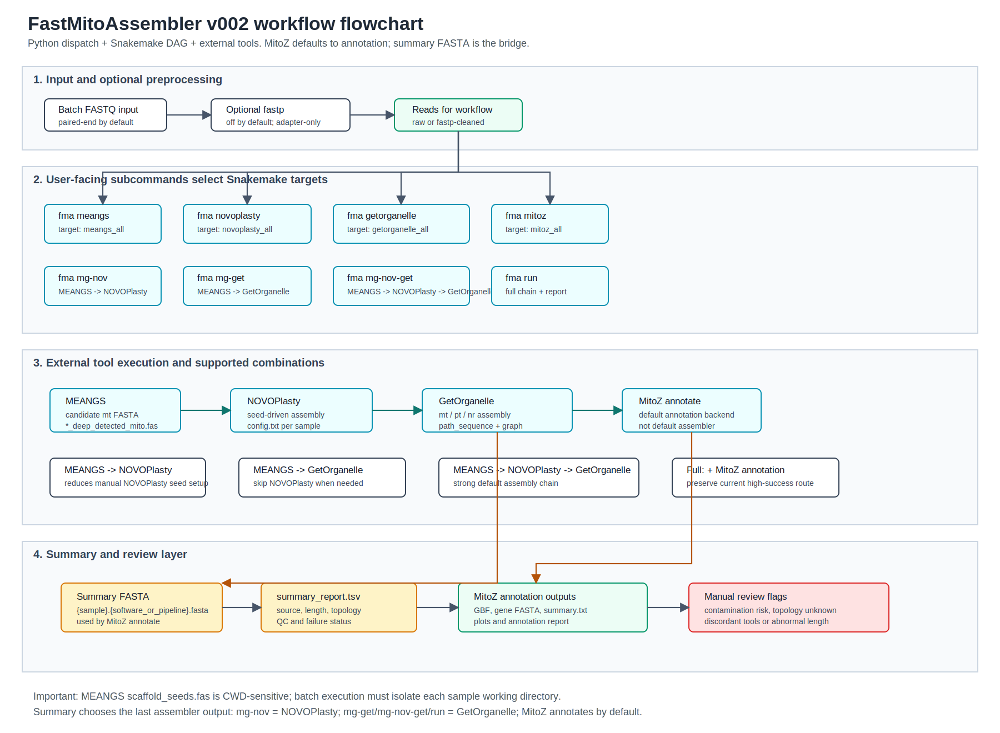

# Fast Assembler Workflow for MitoGenome
> `FastMitoAssembler` (alias: `fma` / `FMA`) is a software for fast, accurate assembly of mitochondrial genomes and generation of annotation documents.

## v002 Beta for Testing

Current beta package version: `0.0.2b0` (`v002-beta`).

- Flowchart: [docs/design/fastmito-v002-flowchart.svg](docs/design/fastmito-v002-flowchart.svg)
- Mermaid source and rules: [docs/design/fastmito-v002-flowchart.md](docs/design/fastmito-v002-flowchart.md)
- v002 design notes: [docs/design/fastmito-v002.md](docs/design/fastmito-v002.md)
- Beta installation guide: [docs/INSTALL-v002.md](docs/INSTALL-v002.md)
- Release note: [docs/releases/v002-beta.md](docs/releases/v002-beta.md)



This beta is intended for dry-run and controlled testing of the modular
workflow interface:

```bash
fma meangs
fma novoplasty
fma getorganelle
fma mitoz
fma mg-nov
fma mg-get
fma mg-nov-get
fma summary
```

### Credits

- **Original idea:** Deyuan Yang
- **Original code:** Bioinformatics engineers at Novogene (诺禾元生物科技)
- **Maintenance & updates:** Managed by Deyuan Yang using [Claude Code](https://claude.ai/code) — leveraging AI-assisted development to keep pace with the rapidly evolving bioinformatics ecosystem

---

## Installation

For the exact v002 beta build, use [docs/INSTALL-v002.md](docs/INSTALL-v002.md).
The general installation below follows the active GitHub repository branch.

FastMitoAssembler uses **two layers of environments**:

```
FastMitoAssembler (main env)          ← pipeline orchestrator (Snakemake + CLI)
├── FastMitoAssembler-meangs          ← MEANGS tool
├── FastMitoAssembler-novoplasty      ← NOVOPlasty tool
├── FastMitoAssembler-getorganelle    ← GetOrganelle tool
└── FastMitoAssembler-mitoz           ← MitoZ tool
```

Each bioinformatics tool lives in its own isolated conda environment to avoid
dependency conflicts. Choose the path that fits your situation:

- **[Path A](#path-a-complete-fresh-installation-recommended)** — Nothing installed yet → follow all steps
- **[Path B](#path-b-tools-already-installed)** — You already have MEANGS / NOVOPlasty / GetOrganelle / MitoZ installed

---

### Path A: Complete fresh installation (recommended)

> Copy and run these commands in order. The whole process takes ~20–40 minutes
> depending on your network speed (mainly downloading MitoZ).

#### 1. Create the main environment

```bash
# mamba is strongly recommended over conda for speed
mamba create -n FastMitoAssembler -c conda-forge \
    python=3.9 "snakemake>=7" click jinja2 pyyaml ete3

conda activate FastMitoAssembler
```

> This environment contains only the pipeline runner (Snakemake + FastMitoAssembler CLI).
> The actual bioinformatics tools are installed in Step 3.

#### 2. Install FastMitoAssembler CLI

```bash
pip install git+https://github.com/deyuanyang92-dev/FastMitoAssembler.git

# Verify
fma --version
```

#### 3. Install all bioinformatics tools

```bash
# Creates four isolated conda environments and saves configs globally:
#   FastMitoAssembler-meangs
#   FastMitoAssembler-novoplasty
#   FastMitoAssembler-getorganelle
#   FastMitoAssembler-mitoz
fma prepare tools
```

> After this step, all future `fma run` calls on this machine automatically
> use these environments — no additional configuration needed.

#### 4. Prepare databases (one-time setup)

```bash
# NCBI taxonomy (required by MitoZ annotation)
fma prepare ncbitaxa

# GetOrganelle reference database — choose the one that matches your samples:
fma prepare organelle -a animal_mt      # animals (most common)
# fma prepare organelle -a embplant_mt  # plant mitochondria
# fma prepare organelle -a embplant_pt  # plant chloroplast
# fma prepare organelle -a all          # all databases (~10 GB)
```

#### 5. Verify the full installation

```bash
fma check
```

Expected output:
```
  Tool              Status           Details
  ──────────────────────────────────────────────────────────────
  meangs            ✓ found          conda env: FastMitoAssembler-meangs
  novoplasty        ✓ found          conda env: FastMitoAssembler-novoplasty
  getorganelle      ✓ found          conda env: FastMitoAssembler-getorganelle
  mitoz             ✓ found          conda env: FastMitoAssembler-mitoz
```

---

### Path B: Tools already installed

If MEANGS, NOVOPlasty, GetOrganelle, and MitoZ are already installed (in PATH,
in existing conda environments, or in a local directory), do the following:

#### 1–2. Create main env + install CLI (same as Path A)

```bash
mamba create -n FastMitoAssembler -c conda-forge \
    python=3.9 "snakemake>=7" click jinja2 pyyaml ete3
conda activate FastMitoAssembler
pip install git+https://github.com/deyuanyang92-dev/FastMitoAssembler.git
```

#### 3. Configure your existing tool installations

**Option 3a — Auto-detect** (if tools are already in PATH or named conda envs):

```bash
fma check --save   # probes each tool and saves found locations globally
```

**Option 3b — Manually configure** each tool:

```bash
# If the tool is in an existing conda environment:
fma config set meangs       --conda-env my_meangs_env
fma config set novoplasty   --conda-env my_novoplasty_env
fma config set getorganelle --conda-env my_getorganelle_env
fma config set mitoz        --conda-env my_mitoz_env

# If the tool binary is in a local directory:
fma config set meangs --bin-dir /opt/meangs/bin
fma config set mitoz  --bin-dir /opt/mitoz/bin

# View current configuration
fma config show

# Remove a configuration (revert to bundled auto mode)
fma config reset meangs
```

Configurations are saved to `~/.config/FastMitoAssembler/tool_envs.yaml`
and apply to all future `fma run` calls on this machine.

You can also override per-project by adding `tool_envs` to your project's `config.yaml`:
```yaml
tool_envs:
  meangs:
    conda_env: 'my_meangs_env'
    bin_dir: ''
  mitoz:
    conda_env: ''
    bin_dir: '/opt/mitoz/bin'
```

#### 4. Prepare databases (same as Path A, Step 4)

```bash
fma prepare ncbitaxa
fma prepare organelle -a animal_mt
```

---

## Update

```bash
conda activate FastMitoAssembler
pip install -U git+https://github.com/deyuanyang92-dev/FastMitoAssembler.git

# Rebuild tool environments if a tool version was bumped
fma prepare tools --force
```

#### Troubleshooting: `fma` command not found after upgrade

If `pip install -U` shows "Requirement already satisfied" and skips the reinstall,
the CLI entry points (`fma`, `FMA`) may not be regenerated. Fix:

```bash
pip install --force-reinstall --no-deps \
    git+https://github.com/deyuanyang92-dev/FastMitoAssembler.git
fma --version
```

---

## Quick Reference — All Commands

```bash
fma --help                          # show all commands
fma --version                       # show version

# ── Installation & setup ──────────────────────────────────────────────────
fma prepare tools                   # install all tool environments
fma prepare tools --force           # reinstall/upgrade all tool environments
fma prepare tools --tool mitoz      # install only one tool
fma prepare ncbitaxa                # download NCBI taxonomy
fma prepare organelle -a animal_mt  # download GetOrganelle database

# ── Tool configuration ────────────────────────────────────────────────────
fma check                           # check tool status
fma check --save                    # check and save found tools globally
fma config show                     # show current global tool config
fma config set <tool> --conda-env <env>   # set conda env for a tool
fma config set <tool> --bin-dir <dir>     # set binary dir for a tool
fma config reset <tool>             # reset tool to auto/bundled mode
fma config reset all                # reset all tools

# ── Project setup ─────────────────────────────────────────────────────────
fma init                            # create config.yaml in current directory
fma init --options                  # also create options.yaml
fma init --force                    # overwrite existing files

# ── Run workflow ──────────────────────────────────────────────────────────
fma run --configfile config.yaml                      # run (recommended)
fma run --configfile config.yaml --dryrun             # preview only
fma run --configfile config.yaml --cores 8            # set CPU cores
fma run --reads_dir ../data                           # auto-detect samples
fma run --reads_dir ../data \
    --suffix_fq '_1.clean.fq.gz,_2.clean.fq.gz;_R1.fastq.gz,_R2.fastq.gz'

# HPC: share tool envs across projects
fma run --configfile config.yaml --conda-prefix ~/.conda/snakemake-envs
```

---

## Config File Reference

Generate a template:
```bash
fma init          # creates config.yaml
fma init --options  # also creates options.yaml
```

Key parameters in `config.yaml`:
```yaml
reads_dir: '../data/'
samples: ['sample1', 'sample2']            # omit to auto-detect from reads_dir
fq_path_pattern: '{sample}/{sample}_1.clean.fq.gz'
result_dir: 'result'

organelle_database: 'animal_mt'
genetic_code: 5                            # 5 = invertebrate mt; 2 = vertebrate mt
clade: 'Annelida-segmented-worms'
genome_min_size: 12000
genome_max_size: 22000

read_length: 150
insert_size: 300
kmer_size: 33
max_mem_gb: 10

cleanup: false    # true = delete intermediate files after each step (saves ~10 GB)

# MEANGS parameters
meangs_reads: 2000000    # reads to sample (reduce for speed)
meangs_deepin: true      # deeper assembly (more accurate, slower)
meangs_clade: 'Annelida-segmented-worms'
# meangs_clade options: Vertebrata | Arthropoda | Mollusca |
#   Annelida-segmented-worms | Echinodermata | Cnidaria | Others
```

`options.yaml` — Snakemake execution options:
```yaml
cores: 4
cluster: "qsub -V -cwd -S /bin/bash -e logs/sge/ -o logs/sge/"
```

---

## Run on HPC / Cluster

```bash
mkdir -p logs/sge/
fma run --configfile config.yaml --optionfile options.yaml
```
```yaml
# options.yaml
cluster: "qsub -V -cwd -S /bin/bash -e logs/sge/ -o logs/sge/"
cores: 20
```

## Run with Docker
[docker-readme](./docker/README.md)

---

## Example Results Directory
`[*]` = main result files

```
result/
└── 2222-4
    ├── 1.MEANGS
    │   ├── 2222-4_deep_detected_mito.fas       [*] seed sequence
    │   └── scaffold_seeds.fas
    ├── 2.NOVOPlasty
    │   ├── config.txt
    │   ├── 2222-4.novoplasty.fasta             [*] draft assembly
    │   └── Contigs_1_2222-4.fasta
    ├── 3.GetOrganelle
    │   ├── animal_mt.get_organelle.fasta        [*] final assembly
    │   └── organelle/
    │       ├── *.path_sequence.fasta            [*] all topology variants
    │       ├── *.selected_graph.gfa             [*] assembly graph
    │       └── *.assembly_graph.fastg           [*] Bandage visualization
    ├── 4.MitozAnnotate
    │   └── 2222-4.animal_mt.get_organelle.fasta.result/
    │       ├── *_mitoscaf.fa.gbf                [*] GenBank annotation
    │       ├── *_mitoscaf.fa.sqn                [*] NCBI submission file
    │       ├── circos.png / circos.svg          [*] circular genome map
    │       └── summary.txt                      [*] gene recovery summary
    └── materials_and_methods.md                 [*] bilingual M&M for papers
```

---

## Softwares Used

- [MEANGS](https://github.com/YanCCscu/meangs)
- [NOVOplasty](https://github.com/Edith1715/NOVOplasty)
- [GetOrganelle](https://github.com/Kinggerm/GetOrganelle)
- [SPAdes](https://github.com/ablab/spades)
- [MitoZ](https://github.com/linzhi2013/MitoZ)
- [NCBI-Blast](https://blast.ncbi.nlm.nih.gov/doc/blast-help/downloadblastdata.html)
