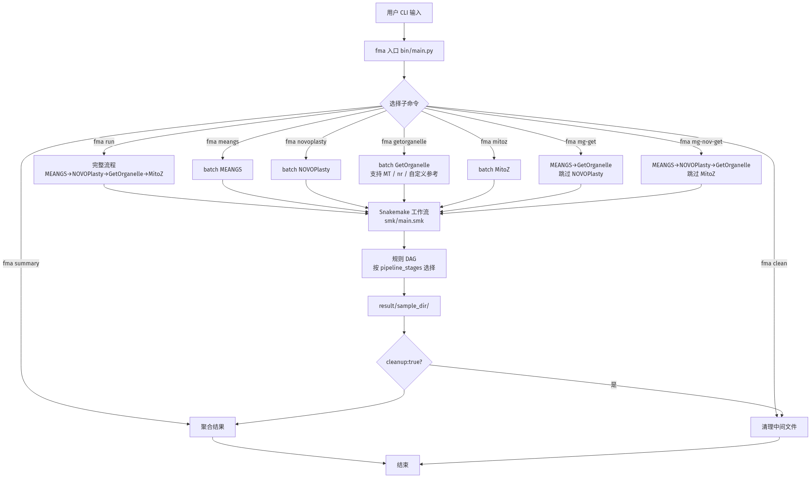
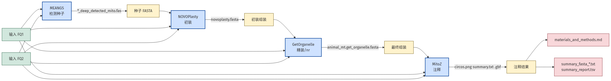
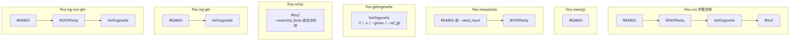
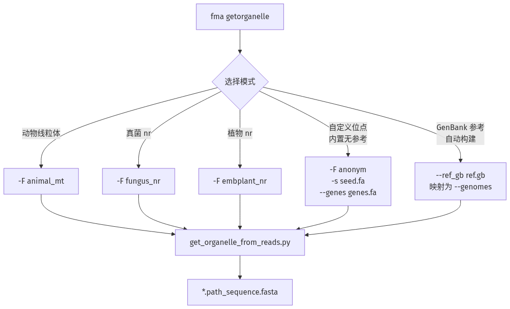

# FastMitoAssembler 子命令化改造方案（中文版）

> 目标：在保留 `fma run` 一键式流程的基础上，把 MEANGS / NOVOPlasty / GetOrganelle / MitoZ 拆成可独立 batch 调用的子命令，并支持组合模式、GetOrganelle 原生参数透传（含 nr 类群）、自动 summary 与 clean。

> **进展（2026-04-21）：** GetOrganelle 参数去硬编码（`getorganelle_*` 扁平键）、可选 `fastp` 接头去除、可调 `subsample_gb` 均已在 `master` 分支落地。本方案其余"子命令"与 `fma summary` / `fma clean` / `fma mg-get` 部分仍为待实施设计。

---

## 一、背景与目标

### 背景
`fma run` 当前是单一入口，强制按 `MEANGS → NOVOPlasty → GetOrganelle → MitoZ` 顺序跑完全部四步。对于已经配好 4 套工具的用户来说：

- 某些类群 NOVOPlasty 效果差，希望**跳过 NOVOPlasty**（直接 MEANGS → GetOrganelle）。
- 只想**单独 batch 某一步**（例如大规模数据集只做 MEANGS 种子检测、或只跑 GetOrganelle）。
- 使用 GetOrganelle **组装 nr（rRNA）位点**（用 `-F fungus_nr` / `embplant_nr` / `anonym`）或**自定义参考**（`-s`、`--genes`、`--genomes` / `--ref_gb`）。
- 批量跑完想要**自动 summary + clean**。

参考设计：`/mnt/d/Claude/Getorganelle_scripts/get_mt_nr_using_meangs_get_v0.01.py`（多模式 batch pipeline）、`summary_get_organelle_output.py`、`batch_getorganelle.py`。

### 目标
让 `fma` 既是"一键流水线"，又是"工具箱" —— 四款工具可以单独、组合或整条链式调用，无需用户复制配置或写临时脚本。

---

## 二、总体架构图





---

## 三、子命令总览

| 子命令 | 执行阶段 | 最终目标 rule | 说明 |
|---|---|---|---|
| `fma run` | meangs → novoplasty → getorganelle → mitoz | `all` | **保持不变**，完整一键流程 |
| `fma meangs` | 仅 meangs | `meangs_all` | 批量种子检测 |
| `fma novoplasty` | (meangs 或用户种子) → novoplasty | `novoplasty_all` | 种子：优先用 MEANGS 结果；缺失时用 `--seed_input` |
| `fma getorganelle` | 仅 getorganelle | `getorganelle_all` | 暴露 GetOrganelle 原生参数，同时支持 MT 和 nr |
| `fma mitoz` | 仅 mitoz | `mitoz_all` | 注释：优先用 GetOrganelle 结果；缺失时用 `--assembly_fasta` |
| `fma mg-get` | meangs → getorganelle | `getorganelle_all` | **跳过 NOVOPlasty**，MEANGS 种子直接传给 GetOrganelle |
| `fma mg-nov-get` | meangs → novoplasty → getorganelle | `getorganelle_all` | 跳过 MitoZ |
| `fma clean` | 后处理 | — | 按阶段删除中间文件；保留 `.fastg` / `.gfa` / `.fasta` / `.sqn` / `.gbf` |
| `fma summary` | 后处理 | — | 汇总 FASTA + 生成 TSV 报告；**每次 batch 结束自动运行** |

---

## 四、数据流程图（完整流水线）





---

## 五、每个子命令的阶段覆盖（阶段图）





---

## 六、GetOrganelle 的多模式支持（MT / nr / 自定义）





**对应 CLI 示例：**
```bash
# 动物线粒体（默认）
fma getorganelle --reads_dir ./data -F animal_mt

# 真菌 nr（使用 GetOrganelle 内置数据库）
fma getorganelle --reads_dir ./data -F fungus_nr -P 0 --max-extending-len 250

# 自定义位点（如某类群无内置参考）
fma getorganelle --reads_dir ./data -F anonym -s my_seed.fa --genes my_genes.fa

# 从 GenBank 文件自动构建种子 + 基因
fma getorganelle --reads_dir ./data --ref-gb ref.gb
```

---

## 七、完整功能与用法

### 1. `fma run` —— 一键完整流程（不变）
```bash
fma run --reads_dir ./data --cores 8
fma run --configfile config.yaml --dryrun
```

### 2. `fma meangs` —— 批量 MEANGS 种子检测
```bash
fma meangs --reads_dir ./data \
           --meangs_thread 4 --meangs_reads 2000000 --meangs_deepin \
           --meangs_clade Arthropoda --cores 8
# 输出：result/{sample}/1.MEANGS/{sample}_deep_detected_mito.fas
```

### 3. `fma novoplasty` —— 批量 NOVOPlasty 组装
```bash
# 自动使用 result/{sample}/1.MEANGS/ 下已有种子
fma novoplasty --reads_dir ./data --genome_min_size 13000 --genome_max_size 17000

# 手动指定种子
fma novoplasty --reads_dir ./data --seed_input my_seed.fa
# 输出：result/{sample}/2.NOVOPlasty/{sample}.novoplasty.fasta
```

### 4. `fma getorganelle` —— 批量 GetOrganelle 组装（支持 MT / nr / 自定义）
```bash
# 动物线粒体（无上游种子时走内置数据库）
fma getorganelle --reads_dir ./data -F animal_mt

# nr 模式
fma getorganelle --reads_dir ./data -F embplant_nr -P 0 --max-extending-len 250

# 自定义种子 + genes
fma getorganelle --reads_dir ./data -F anonym -s seed.fa --genes genes.fa

# GenBank 参考自动构建
fma getorganelle --reads_dir ./data --ref-gb ref.gb

# 完整参数透传
fma getorganelle --reads_dir ./data \
                 -F animal_mt -R 20 \
                 -k 21,33,45,55,65,75,85,95,105,111,127
# 输出：result/{sample}/3.GetOrganelle/{F}.get_organelle.fasta
```

### 5. `fma mitoz` —— 批量 MitoZ 注释
```bash
# 自动检测 result/{sample}/3.GetOrganelle/ 下已有组装
fma mitoz --reads_dir ./data --clade Arthropoda --genetic_code 5

# 手动指定组装 FASTA
fma mitoz --reads_dir ./data --assembly_fasta path/to/assembly.fasta
# 输出：result/{sample}/4.MitozAnnotate/.../circos.png / summary.txt / *.gbf
```

### 6. `fma mg-get` —— MEANGS → GetOrganelle（跳过 NOVOPlasty）
```bash
fma mg-get --reads_dir ./data -F animal_mt --cores 8
# MEANGS 种子直接用作 GetOrganelle 的 -s 参数
```

### 7. `fma mg-nov-get` —— MEANGS → NOVOPlasty → GetOrganelle（跳过 MitoZ）
```bash
fma mg-nov-get --reads_dir ./data --cores 8
# 用于只要组装、不需要注释的场景
```

### 8. `fma summary` —— 汇总结果
```bash
fma summary                          # 扫描 result/ 生成汇总
fma summary --result_dir result2/    # 指定路径
# 输出：
#   result/summary_fasta_mt.txt      所有 MT 组装合并（标准化 header）
#   result/summary_fasta_nr.txt      所有 nr 组装合并（如果有）
#   result/summary_fasta_all.txt     全部合并
#   result/summary_report.tsv        每个样本的指标表
```

**header 标准化格式**（参考设计 line 931）：
```
>{sample}|locus={mt|nr}|{idx} topology={circular|linear}
```

### 9. `fma clean` —— 清理中间文件
```bash
fma clean                            # 清理所有阶段（默认）
fma clean --stage meangs             # 只清 MEANGS 中间目录
fma clean --stage getorganelle       # 清 filtered_spades/ + extended*.fq
                                     # 保留 .fastg / .gfa / .fasta（Bandage 可视化需要）
fma clean --stage mitoz              # 只清 tmp_*
```

**始终保留的产物**（根据历史反馈）：
- GetOrganelle：`*.fastg`、`*.gfa`、`*.fasta`、`*.path_sequence.fasta`
- MitoZ：`*.sqn`、`*.gbf`、`circos.png`、`summary.txt`
- 所有 `materials_and_methods.md`

---

## 八、文件改动清单

### 修改
| 文件 | 改动 |
|---|---|
| `FastMitoAssembler/bin/main.py` | 注册 8 个新子命令 |
| `FastMitoAssembler/bin/_run.py` | 抽取配置合并 + snakemake 调用逻辑到共享 helper；`run` 命令行为保持不变 |
| `FastMitoAssembler/smk/main.smk` | 添加 `pipeline_stages` 分发逻辑；`GetOrganelle` 规则用 `unpack()` 条件输入；shell 命令可选包含 `-s` / `--genes` / `--genomes`；新增 target 别名规则 |
| `FastMitoAssembler/smk/config.yaml` | 新增 `pipeline_stages`（其余 `getorganelle_*` / `subsample_gb` / `fastp.*` 已于 2026-04-21 落地） |

### 新建
| 文件 | 作用 |
|---|---|
| `FastMitoAssembler/bin/_stages.py` | 共享 `_build_run()` helper + 6 个子命令（meangs / novoplasty / getorganelle / mitoz / mg_get / mg_nov_get） |
| `FastMitoAssembler/bin/_summary.py` | `fma summary` + 供 batch 末尾自动调用的 `run_summary()` |
| `FastMitoAssembler/bin/_clean.py` | `fma clean [--stage]` + 供 batch 末尾自动调用的 `run_clean()` |
| `tests/test_stages.py` | 各子命令 dryrun target 选择测试 |
| `tests/test_summary.py` | FASTA 合并 + TSV 生成测试 |
| `tests/test_clean.py` | 按阶段删除 + 保护 `.fastg` 等测试 |

---

## 九、Snakemake 关键改造

### 阶段分发
`smk/main.smk` 顶部：
```python
DEFAULT_STAGES = ['meangs', 'novoplasty', 'getorganelle', 'mitoz']
STAGES = config.get('pipeline_stages') or DEFAULT_STAGES
```

### GetOrganelle 条件输入
```python
def _getorganelle_inputs(wildcards):
    inputs = {'fq1': FQ1.format(**wildcards), 'fq2': FQ2.format(**wildcards)}
    if 'novoplasty' in STAGES:
        inputs['seed'] = novoplasty_fasta.format(**wildcards)
    elif 'meangs' in STAGES:
        inputs['seed'] = seed_fas.format(**wildcards)
    # 否则：无上游种子，用户通过 config.seed_input / ref_gb / genes 提供
    return inputs

rule GetOrganelle:
    input: unpack(_getorganelle_inputs)
```

### Target 别名规则
```python
rule meangs_all:
    input: expand(seed_fas, sample=SAMPLES)

rule novoplasty_all:
    input: expand(novoplasty_fasta, sample=SAMPLES)

rule getorganelle_all:
    input: expand(organelle_fasta_new, sample=SAMPLES)

rule mitoz_all:
    input:
        expand(MITOZ_ANNO_RESULT_DIR("circos.png"), sample=SAMPLES),
        expand(mm_report(), sample=SAMPLES),
```

CLI 通过 `snakemake.snakemake(..., targets=['<alias>_all'])` 指定目标。

---

## 十、配置 Schema 增量

`smk/config.yaml` 新增字段分两部分：

**已落地（2026-04-21 master）——** 扁平的 `getorganelle_*` 键 + `subsample_gb` + `fastp.*`。空值表示**不**向 GetOrganelle 透传该参数，让其按 `-F` 自行取默认值（例如 `animal_mt` 下 `--max-reads` 默认 3E8 / `--reduce-reads-for-coverage` 默认 500）。依据见 `get_organelle_from_reads.py --help`。

```yaml
# GetOrganelle 参数（空=不透传，由 GetOrganelle 根据 -F 选默认值）
getorganelle_threads: 4                     # -t（上游默认 1）
getorganelle_rounds:                        # -R；空=animal_mt 默认 10
getorganelle_kmers:                         # -k；空=默认 "21,55,85,115"
getorganelle_max_reads:                     # --max-reads；"inf"=全部 reads
getorganelle_reduce_reads_for_coverage:     # --reduce-reads-for-coverage
getorganelle_word_size:                     # -w；空=自动估计
getorganelle_max_extending_len:             # --max-extending-len
getorganelle_all_data: false                # true → 同时设 max-reads inf + reduce inf

# GetOrganelle 之前的 reads 抽样（替代原硬编码 5G）
subsample_gb: 5                             # 0/null=不抽样，全部 reads

# 可选的上游接头去除（默认关闭，项目约定 *.clean.fq.gz 已去接头）
# NOVOPlasty / GetOrganelle 作者均建议禁用 Phred 质量修剪，
# 仅做接头去除（-Q 关闭质量过滤，-L 关闭长度过滤）
fastp:
  enabled: false
  extra_args: ''                            # 例 '-G' 在 NovaSeq 数据上关闭 polyG 修剪
```

**待实施（子命令化配套）——** 阶段分发键：

```yaml
# 阶段控制（空=完整流程，向后兼容）
pipeline_stages: []
```

---

## 十一、端到端验证

```bash
# 1. 回归：完整流程不变
fma run --reads_dir test/reads --dryrun

# 2. 单阶段
fma meangs --reads_dir test/reads --dryrun          # 只有 MEANGS rule 触发
fma getorganelle --reads_dir test/reads -F animal_mt --dryrun
fma getorganelle --reads_dir test/reads -F fungus_nr -P 0 --max-extending-len 250 --dryrun
fma getorganelle --reads_dir test/reads --ref-gb ref.gb --dryrun
fma mitoz --reads_dir test/reads --dryrun           # 检测已有 GetOrganelle 输出

# 3. 组合
fma mg-get --reads_dir test/reads --dryrun          # MEANGS + GetOrganelle
fma mg-nov-get --reads_dir test/reads --dryrun      # 除 MitoZ 外全部

# 4. 后处理
fma summary                                          # summary_*.txt + summary_report.tsv
fma clean --stage getorganelle                       # 删除 filtered_spades/，保留 .fastg

# 5. 回归测试
python -m pytest tests/ -v                           # 现有 43 个测试仍通过
```

---

## 十二、PDF 文档生成（附加任务）

本文档最终将导出为 PDF，命令：
```bash
pandoc FastMitoAssembler-subcommands-plan.md \
    -o FastMitoAssembler-subcommands-plan.pdf \
    --pdf-engine=xelatex \
    -V CJKmainfont="Noto Sans CJK SC" \
    -V mainfont="DejaVu Serif" \
    -V geometry:margin=2cm \
    --toc
```

**中文字体依赖**：需要系统安装 `fonts-noto-cjk`（Debian/Ubuntu：`apt install fonts-noto-cjk`）或 `Noto Sans CJK SC`。如果没有，使用 `WenQuanYi Micro Hei` 作为 fallback。安装命令：
```bash
apt install -y pandoc texlive-xetex fonts-noto-cjk fonts-wqy-microhei
```

Mermaid 流程图渲染：用 `mermaid-cli` 将 mermaid 代码块预先渲染成 PNG，再嵌入 Markdown。命令：
```bash
npm install -g @mermaid-js/mermaid-cli
mmdc -i plan.md -o plan-with-pngs.md
pandoc plan-with-pngs.md -o plan.pdf --pdf-engine=xelatex -V CJKmainfont="Noto Sans CJK SC"
```
