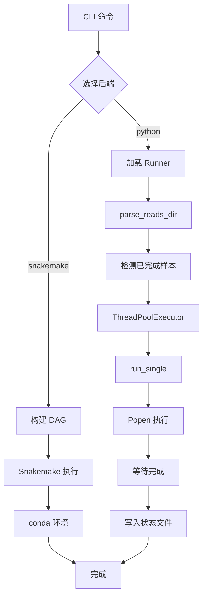
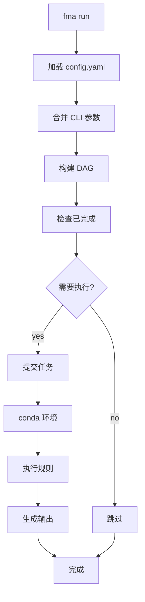

# 双后端架构说明

## 概述

FastMitoAssembler 采用**双后端架构**，所有工具同时支持 **Snakemake** 和 **Python** 两种执行方式。

---

## 后端对比

| 特性 | Snakemake 后端 | Python 后端 |
|------|----------------|-------------|
| **依赖管理** | 自动 DAG 管理 | 手动顺序执行 |
| **断点续跑** | 自动检测 | 自动检测 |
| **HPC 支持** | 内置集群支持 | 需手动配置 |
| **安装要求** | 需要 Snakemake | 无额外依赖 |
| **适用场景** | 复杂流程、HPC | 简单批量处理 |
| **并行执行** | 内置调度 | ThreadPoolExecutor |

---

## 使用方式

### Snakemake 后端

```bash
# 默认使用 Snakemake
fma meangs --reads_dir /data -o result

# 指定 Snakemake 后端
fma meangs --backend snakemake --reads_dir /data -o result

# HPC 集群
fma meangs --backend snakemake \
    --cluster "qsub -V -cwd" \
    --cores 48
```

### Python 后端

```bash
# 使用 Python 后端
fma meangs --backend python \
    --reads_dir /data \
    -o result \
    --parallel-jobs 5 \
    --threads 16
```

---

## Python Runner 设计

### 核心类结构

```python
class BaseRunner:
    def build_command(self, **kwargs) -> List[str]:
        """构建命令行参数"""
        raise NotImplementedError

    def is_sample_done(self, output_dir: Path) -> bool:
        """检查样本是否已完成"""
        raise NotImplementedError

    def run_single(self, sample: str, **kwargs) -> Dict:
        """执行单个样本"""

    def run_batch(self, samples: Dict, output_dir: Path,
                  parallel_jobs: int = 3, **kwargs) -> List[Dict]:
        """批量并行执行"""
```

### 关键特性

#### 1. Popen 流式读取

避免缓冲区满导致子进程挂起：

```python
proc = subprocess.Popen(
    cmd,
    stdout=log_file,
    stderr=subprocess.STDOUT,
)
returncode = proc.wait()
```

#### 2. Checkpoint 检测

自动检测已完成样本：

```python
def is_sample_done(output_dir: Path, sample: str) -> bool:
    sample_dir = output_dir / sample
    expected_files = ["contigs.fasta", "scaffolds.fasta"]
    return all((sample_dir / f).exists() for f in expected_files)
```

#### 3. ThreadPoolExecutor 并行

```python
with ThreadPoolExecutor(max_workers=parallel_jobs) as executor:
    futures = {}
    for sample, (fq1, fq2) in samples.items():
        future = executor.submit(
            self.run_single,
            sample=sample,
            fq1=fq1,
            fq2=fq2,
            output_dir=output_dir,
        )
        futures[future] = sample
```

#### 4. 信号处理

优雅终止子进程：

```python
def _signal_handler(signum, frame):
    for sample, proc in _running_processes.items():
        if proc.poll() is None:
            proc.terminate()
    sys.exit(128 + signum)

signal.signal(signal.SIGINT, _signal_handler)
signal.signal(signal.SIGTERM, _signal_handler)
```

#### 5. 状态文件

记录成功/失败样本：

```python
def _write_status_files(results: List[Dict], output_dir: Path):
    finished = [r["sample"] for r in results if r.get("success")]
    unfinished = [r["sample"] for r in results if not r.get("success")]

    with open(output_dir / "finished.txt", "w") as f:
        for sample in finished:
            f.write(f"{sample}\n")

    with open(output_dir / "unfinished.txt", "w") as f:
        for sample in unfinished:
            f.write(f"{sample}\n")
```

---

## Runner 实现列表

| Runner | 文件 | 工具 |
|--------|------|------|
| `FastpRunner` | `_fastp_runner.py` | fastp |
| `MeangsRunner` | `_meangs_runner.py` | MEANGS |
| `NovoplastyRunner` | `_novoplasty_runner.py` | NOVOPlasty |
| `GetOrganelleRunner` | `_getorganelle_runner.py` | GetOrganelle |
| `MitozRunner` | `_mitoz_runner.py` | MitoZ |
| `SpadesRunner` | `_spades_runner.py` | SPAdes |
| `BuscoRunner` | `_busco_runner.py` | BUSCO |
| `MultiqcRunner` | `_multiqc_runner.py` | MultiQC |

---

## Snakemake 规则对应

| Runner | Snakemake 规则文件 | 主要规则 |
|--------|-------------------|----------|
| FastpRunner | `rules/preprocess.smk` | `rule fastp_adapter_trim` |
| MeangsRunner | `rules/meangs.smk` | `rule meangs` |
| NovoplastyRunner | `rules/novoplasty.smk` | `rule novoplasty` |
| GetOrganelleRunner | `rules/getorganelle.smk` | `rule getorganelle` |
| MitozRunner | `rules/mitoz.smk` | `rule mitoz_annotate` |
| SpadesRunner | `rules/spades.smk` | `rule spades` |
| BuscoRunner | `rules/busco.smk` | `rule busco` |
| MultiqcRunner | `rules/multiqc.smk` | `rule multiqc` |

---

## 样本检测

### parse_reads_dir 函数

所有 Runner 使用统一的样本检测逻辑：

```python
def parse_reads_dir(
    reads_dir: Path,
    r1_suffix: str = "_1.fastq.gz",
    r2_suffix: str = "_2.fastq.gz",
    fastq_pos: str = "recursive",
) -> Dict[str, Tuple[str, str]]:
    """
    解析 reads 目录，返回样本字典。

    Returns:
        {sample_name: (fq1_path, fq2_path)}
    """
```

### 目录结构模式

**recursive** (默认):
```python
for f in reads_dir.rglob(f"*{r1_suffix}"):
    sample = f.parent.name
    fq2 = f.parent / f.name.replace(r1_suffix, r2_suffix)
    if fq2.exists():
        samples[sample] = (str(f), str(fq2))
```

**subdir**:
```python
for subdir in reads_dir.iterdir():
    if subdir.is_dir():
        for f in subdir.glob(f"*{r1_suffix}"):
            sample = subdir.name
            fq2 = subdir / f.name.replace(r1_suffix, r2_suffix)
            samples[sample] = (str(f), str(fq2))
```

**flat**:
```python
for f in reads_dir.glob(f"*{r1_suffix}"):
    sample = f.name[:-len(r1_suffix)]
    fq2 = reads_dir / f.name.replace(r1_suffix, r2_suffix)
    samples[sample] = (str(f), str(fq2))
```

---

## 工具环境配置

### 全局配置

保存到 `~/.config/FastMitoAssembler/tool_envs.yaml`：

```yaml
meangs:
  conda_env: FastMitoAssembler-meangs
  bin_dir: ''
  script_path: ''
novoplasty:
  conda_env: FastMitoAssembler-novoplasty
getorganelle:
  conda_env: FastMitoAssembler-getorganelle
mitoz:
  conda_env: FastMitoAssembler-mitoz
```

### 项目配置

在 `config.yaml` 中覆盖：

```yaml
tool_envs:
  meangs:
    conda_env: my-custom-meangs
  mitoz:
    bin_dir: /opt/mitoz/bin
```

### Shell Prefix 构建

Runner 自动构建 shell 前缀：

```python
def _build_shell_prefix(tool_cfg: Dict) -> str:
    if tool_cfg.get('conda_env'):
        return f'conda run --no-capture-output -n {tool_cfg["conda_env"]} '
    elif tool_cfg.get('bin_dir'):
        return f'PATH="{tool_cfg["bin_dir"]}:$PATH" '
    return ''
```

---

## 错误处理

### 成功关键词检测

从日志中检测成功关键词：

```python
SUCCESS_KEYWORDS = {
    "spades": ["SPAdes finished", "assembly finished"],
    "busco": ["BUSCO analysis completed"],
    "fastp": ["fastp done", "processing completed"],
}

def check_success(log_file: Path, keywords: List[str]) -> bool:
    content = log_file.read_text(errors="ignore")
    return any(kw in content for kw in keywords)
```

### 错误诊断

```python
def diagnose_error(log_file: Path) -> Dict:
    """诊断错误原因"""
    errors = {
        "memory": "Memory limit exceeded",
        "timeout": "Process timeout",
        "input": "Input file not found",
    }

    content = log_file.read_text(errors="ignore")
    for key, msg in errors.items():
        if msg in content:
            return {"type": key, "message": msg}

    return {"type": "unknown", "message": "Unknown error"}
```

---

## 执行流程

### Python 后端流程



### Snakemake 后端流程



---

## 最佳实践

### 1. 选择合适的后端

- **简单批量处理** → Python 后端
- **复杂依赖流程** → Snakemake 后端
- **HPC 集群** → Snakemake 后端

### 2. 调整并行参数

```bash
# 高性能服务器
--parallel-jobs 6 --threads 16

# 普通服务器
--parallel-jobs 3 --threads 8

# 低配置
--parallel-jobs 1 --threads 4
```

### 3. 监控进度

```bash
# 查看日志
tail -f result/logs/*.log

# 查看状态文件
cat result/finished.txt
cat result/unfinished.txt
```

### 4. 断点续跑

直接重新运行相同命令，已完成样本会自动跳过。

### 5. 错误处理

查看 `unfinished.txt` 中的失败样本，检查日志文件诊断问题。